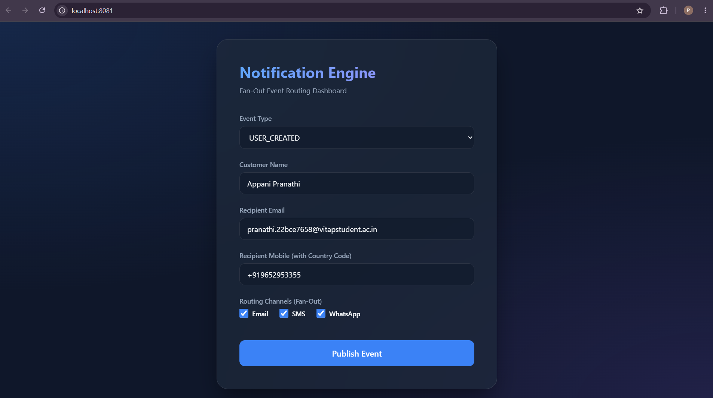
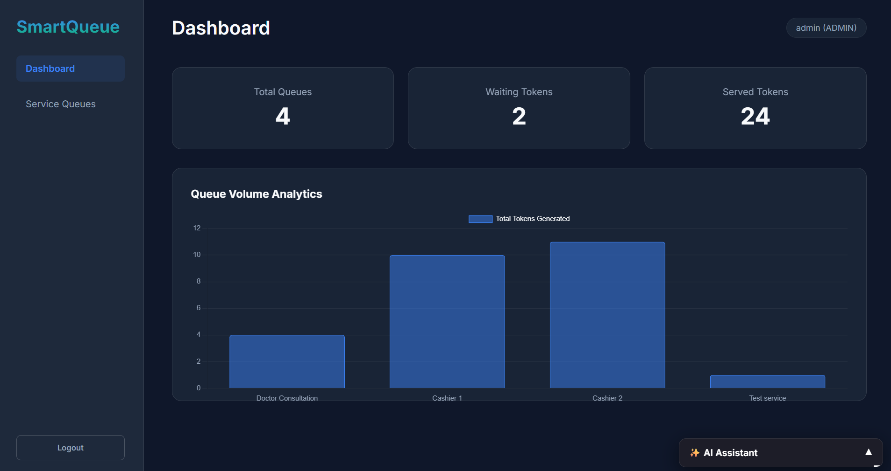
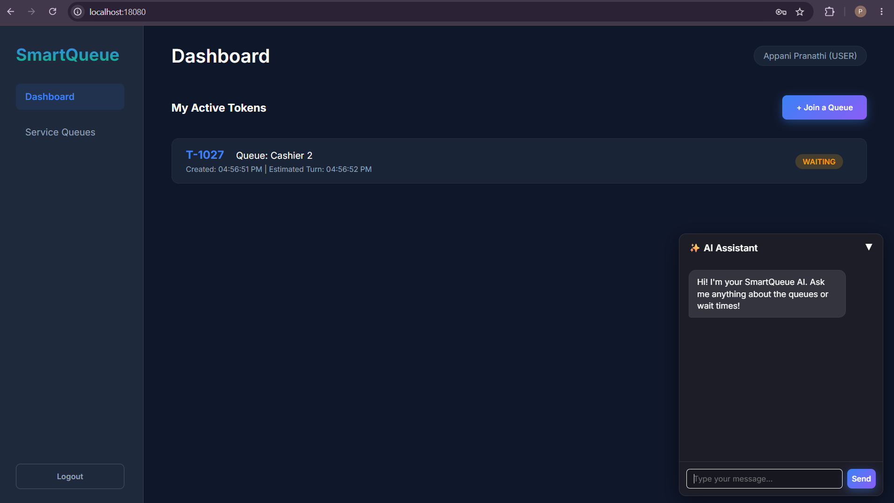

# SmartQueue

SmartQueue is a modern, responsive queue management system built to handle both live (walk-in) and scheduled (appointment-based) service queues. It features a robust Spring Boot backend with a microservices-ready architecture using Kafka and Redis, and a sleek, glassmorphism-styled frontend.

## Features

- **Queue Management:** Create and manage diverse queues with custom service times and scheduling buffers.
- **Real-Time Token Tracking:** Generate standard and VIP tokens, track expected wait times, and monitor token statuses (WAITING, ACTIVE, COMPLETED, DELAYED).
- **Role-Based Access Control (RBAC):** Distinct dashboards and capabilities for Admins (queue creation, analytics) and regular Users (token generation, tracking).
- **Secure Authentication:** JWT-based authentication with session persistence and graceful expiration handling.
- **Analytics Dashboard:** Visual insights into queue volumes and token statistics using Chart.js.
- **AI Assistant:** Integrated floating chat widget for interacting with an AI assistant to answer queue-related queries.

## Technology Stack

- **Backend:** Java 21, Spring Boot, Spring Data JPA, Spring Security (JWT)
- **Database & Messaging:** PostgreSQL (Primary Data), Redis (Caching/Fast Data), Apache Kafka & Zookeeper (Event Streaming)
- **Frontend:** HTML5, CSS3 (Custom Glassmorphism UI), Vanilla JavaScript, Chart.js
- **Infrastructure:** Docker & Docker Compose

## Prerequisites

- [Docker](https://www.docker.com/) and [Docker Compose](https://docs.docker.com/compose/) installed on your machine.

## Getting Started

1. **Navigate to the project root directory** where the `docker-compose.yml` file is located.
2. **Build and start the application containers:**
   ```bash
   docker-compose up -d --build
   ```
3. **Access the Application:**
   Open your web browser and navigate to `http://localhost:8081`.

## Screenshots

- **Main Dashboard:** 
- **Admin Dashboard:** 
- **User Dashboard:** 

## Usage Guide

- **Register as Admin:** Check the "Register as Admin Account" box during registration to explore administrative features like creating queues and viewing analytics.
- **Managing Queues:** Admins can define queue operational hours, average service times, and slot durations.
- **Joining a Queue:** Standard users can select a queue, request a token, and instantly see their estimated wait time or appointment slot.
- **AI Chat:** Click the ✨ AI Assistant floating widget in the bottom right to get help navigating the platform.
